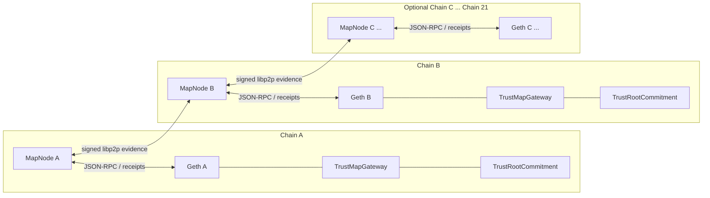

# TrustMap Prototype

[English](README.md) | [简体中文](README.zh-CN.md)

TrustMap Prototype is the open-source experimental implementation of the TrustMap paper design. It provides the on-chain trust commitments and verification contracts, a real Geth-based multi-chain environment, and one usable MapNode per chain. The MapNode follows confirmed events, validates and exchanges dependency evidence, maintains a durable `TrustView`, chooses a `DirectPlan` or `PathPlan`, and submits the selected proof to its home-chain Gateway.

> **Research prototype.** This repository is designed to reproduce and evaluate the paper's verification mechanisms. It is not an asset bridge or production security infrastructure. The default `pow-spv-3m` direct verifier uses real signatures plus calibrated computation to reproduce the target verification cost; it is not a PoW light client and must not be described as providing SPV security.

## What is implemented

| Paper concept | Prototype implementation |
| --- | --- |
| `TrustRoot` | A hash-bound commitment to a chain's confirmed trust state, observed from canonical Geth blocks and persisted by MapNode. |
| `TrustView` | A durable, evidence-backed local graph maintained independently by each MapNode. |
| `TrustEdge` | A verified dependency relation between chain/block trust nodes. |
| Direct verification | `ExperimentalCostedDirectVerifier` verifies ordered authorized signatures and runs configured chained Keccak rounds to reproduce the paper-scale cost. |
| Path verification | `PathProofVerifier` checks a recursive path over committed trust relations. |
| Planning | MapNode compares estimated Direct and Path costs and deterministically selects `DirectPlan` or `PathPlan`. |
| Multi-chain deployment | Docker Compose renders one Geth node and one MapNode for each configured chain on an isolated Docker network. |
| Evaluation replay | The same MapNode binary replays the historical trace through a separate `ReplayTrustView` and the paper-compatible cost model. |

## Architecture



The P2P network is used to discover signed evidence. Canonical Geth headers and receipts, deployed contract bytecode, and Gateway state remain authoritative. Evidence received from another MapNode is never accepted solely because it arrived over libp2p.

## Verification flows

### Direct verification

1. The destination Gateway emits a verification request bound to its source chain, source block, source `TrustRoot`, destination context, and request identifier.
2. The local MapNode waits for the configured confirmation depth and validates the canonical event and source observation.
3. The planner estimates Direct cost from the configured profile. In replay compatibility mode, this is based on the paper's height-distance cost.
4. `ExperimentalCostedDirectVerifier` performs the deployment-fixed Keccak rounds and checks the deployment-fixed number of ordered signatures from `authorizedSigners`.
5. The Gateway records the dependency and resolves the request. The resulting `TrustEdge` can be propagated to other MapNodes.

The submitter cannot reduce `hashRounds`, `signatureChecks`, or the authorized signer set. These parameters are fixed by topology and deployment configuration.

### Path verification

1. MapNode validates local and remotely discovered `TrustRoot` evidence and materializes `TrustEdge` entries in its `TrustView`.
2. The planner searches for a valid path from the destination trust node to the requested source trust node.
3. It compares the estimated path cost with the Direct alternative using the same selected cost profile.
4. When Path is cheaper, MapNode builds the recursive `PathProof` and submits it to the Gateway.
5. `PathProofVerifier` validates the bound path; the Gateway records the new dependency and resolves the request.

Ordinary within-chain ancestry, such as `C:201 -> C:200`, is supported. Replay normalizes heights before evaluating distance-dependent costs.

## Main components

### Smart contracts

| File | Responsibility |
| --- | --- |
| `contracts/src/TrustMapGateway.sol` | Request lifecycle, context binding, Direct/Path dispatch, dependency recording, and resolution events. |
| `contracts/src/TrustRootCommitment.sol` | Stores and verifies committed trust roots. |
| `contracts/src/ExperimentalCostedDirectVerifier.sol` | Experimental real-signature verifier with deployment-fixed cost-calibration rounds. |
| `contracts/src/IDirectVerifier.sol` | Direct-verifier interface used by the Gateway. |
| `contracts/src/PathProofVerifier.sol` | Recursive TrustMap path-proof validation. |

### MapNode

| Package | Responsibility |
| --- | --- |
| `Mapnode/app` | Runtime composition and worker lifecycle. |
| `Mapnode/bootstrap` | Configuration, manifest, and verifier-profile validation. |
| `Mapnode/chain`, `chainabi`, `reorg` | Geth RPC access, ABI handling, canonical block/hash observation, and reorganization safety. |
| `Mapnode/indexer` | Confirmed Gateway event indexing and receipt validation. |
| `Mapnode/evidence` | Local and remote evidence validation. |
| `Mapnode/p2p` | Signed libp2p GossipSub locator propagation. |
| `Mapnode/trustview` | `TrustRoot`, `TrustView`, `TrustEdge`, snapshots, and witness handling. |
| `Mapnode/planner` | Deterministic `DirectPlan`/`PathPlan` selection. |
| `Mapnode/proof` | Recursive `PathProof` construction and proof material. |
| `Mapnode/coordinator` | Durable request, plan, and proof state transitions. |
| `Mapnode/executor` | Serialized Direct/Path transactions, nonce recovery, and receipt confirmation. |
| `Mapnode/store` | SQLite/WAL storage, migrations, and durable repositories. |
| `Mapnode/api` | Minimal read-only health, status, request, and TrustView API. |
| `Mapnode/replay` | Isolated `ReplayTrustView`, B0-B3 settings, cost profiles, resume, exports, and golden checks. |

### Tooling and configuration

| Path | Purpose |
| --- | --- |
| `cmd/mapnode` | Runs the live MapNode service or finite replay mode. |
| `cmd/trustmapctl` | Validates and renders topology definitions. |
| `cmd/replaycheck` | Verifies replay artifacts against golden aggregates and row-level semantic digests. |
| `configs/topology-2.yaml` | Two-chain Direct experiment. |
| `configs/topology.yaml` | Three-chain recursive Path experiment. |
| `configs/topology-21.yaml` | Configurable 21-chain static topology. |
| `configs/replay` | Replay matrices, profiles, checkpoints, and golden expectations. |
| `scripts` | Live-experiment and replay entry points. |

## Security boundary and non-goals

- `ExperimentalCostedDirectVerifier` is a costed attestation verifier. Its real signature checks preserve request and Gateway binding, while its Keccak loop calibrates gas. It does **not** implement a block-header chain, consensus verification, or PoW SPV security.
- P2P messages are discovery hints. MapNode validates canonical chain data before making evidence authoritative.
- The prototype does not custody or transfer assets and is not a bridge.
- Transaction execution is intentionally serialized for deterministic experiments. Production fee bumping, multi-sender nonce management, and arbitrary third-party replacement handling are out of scope.
- The 21-chain topology demonstrates configurable rendering and startup support. It is not, by itself, a claim that a 21-chain live load test has been completed.
- Replay estimates paper-compatible costs and does not execute one Geth transaction or SPV verification for every trace row.

## Requirements

- Go 1.24.10
- Docker Engine with Docker Compose v2
- Foundry 1.4.4 for contract development and tests
- Bash and `curl` for integration scripts

Container images and the topology toolchain are pinned for reproducibility.

## Quick start

Run all commands from the repository root.

```sh
go test -race ./... -count=1
go vet ./...
forge test --root contracts -vv
```

Validate and render the default three-chain topology:

```sh
go run ./cmd/trustmapctl topology validate --file configs/topology.yaml
go run ./cmd/trustmapctl topology render \
  --file configs/topology.yaml \
  --output runtime/generated
docker compose -f runtime/generated/compose.yaml config --quiet
```

Topology definitions control chain count, chain IDs, Geth block periods, MapNode identities, confirmation depth, ports, verifier profiles, signer counts, and hash rounds. The supplied examples support 2, 3, and 21 chains; each rendered chain receives one Geth container and one MapNode container.

## Live Geth experiments

The integration scripts create an isolated runtime directory, render the topology, build and start real Geth, deployer, and MapNode containers, perform bounded readiness checks, assert the expected on-chain events, retain logs, and remove containers and volumes.

### Two-chain Direct closed loop

```sh
./scripts/run-two-chain-direct.sh
# Equivalent integration entry point:
./tests/integration/live_two_chain_test.sh
```

The experiment submits a request whose source is chain A and destination is chain B, executes a real Direct transaction, and asserts `DirectVerificationSucceeded`, `DependencyRecorded`, and `RequestResolved`. It also checks that the resulting `B -> A` edge is propagated.

### Three-chain Path closed loop

```sh
./scripts/run-three-chain-path.sh
# Equivalent integration entry point:
./tests/integration/live_three_chain_test.sh
```

The experiment establishes `B -> A` and `C -> B`, then requests verification from C to A. It requires MapNode C to select and execute a two-hop `PathPlan` without Direct fallback and asserts the corresponding Path, dependency, and resolution events.

Generated runtime artifacts and Compose logs are written below `runtime/`. This directory is local experiment state and is not part of the source distribution.

## Replay experiments

`mapnode replay` is a finite experiment mode in the same MapNode binary. It uses the production planner logic with an isolated replay database and `ReplayTrustView`. It does not start Geth, submit per-row transactions, or modify the live `TrustView`.

### B0-B3 settings

Each setting has isolated SQLite/WAL state.

| Setting | TrustMap planner | Checkpoint-assisted Direct |
| --- | --- | --- |
| B0 | No | No |
| B1 | No | Yes |
| B2 | Yes | No |
| B3 | Yes | Yes |

### Cost profiles

| Profile | Direct height step | Path edge/height step | TrustRoot update | Use |
| --- | ---: | ---: | ---: | --- |
| `legacy-v4.1` | 3,000,000 gas | 30,000 gas | 110,000 gas | Exact reproduction of the original simulator's evaluation semantics. |
| `prototype-calibrated` | 3,000,096 gas | 30,713 gas | 108,582 gas | Sensitivity analysis based on this prototype's measurements. |

Neither replay profile claims to execute SPV. Live contract gas and replay-estimated costs are deliberately separated.

### Smoke replay

The bundled six-row, three-chain fixture is sufficient to validate parsing, all four settings, planner selection, persistence, export, and golden checking:

```sh
./scripts/replay-smoke.sh
./tests/integration/replay_smoke_test.sh
```

Optional environment overrides are `TRACE_PATH`, `RUN_ROOT`, `SETTINGS`, `PROFILE`, and `MAPNODE_BIN`.

```sh
RUN_ROOT=/tmp/trustmap-smoke \
SETTINGS='B2,B3' \
PROFILE=prototype-calibrated \
./scripts/replay-smoke.sh
```

### Full 245,000-message replay

The complete historical trace is **not currently stored in this repository**. The repository contains only small test fixtures. For local compatibility, `scripts/replay-full.sh` looks for the read-only sibling path `../TrustMap-ETH/Dune/output_202512/msg.csv` by default. Open-source users must provide the trace explicitly:

```sh
TRACE_PATH=/absolute/path/to/msg.csv \
RUN_ROOT=/absolute/path/to/replay-runs \
SETTINGS='B0 B1 B2 B3' \
PROFILE=legacy-v4.1 \
./scripts/replay-full.sh
```

Equivalent flags are available:

```sh
./scripts/replay-full.sh \
  --trace /absolute/path/to/msg.csv \
  --run-root /absolute/path/to/replay-runs \
  --settings 'B0 B1 B2 B3' \
  --profile legacy-v4.1
```

The project provides the Dune query used to obtain the experimental data. Because of repository size constraints, the complete raw dataset and the prepared full trace are not included; users can run the query to obtain the data or supply an existing prepared trace through `TRACE_PATH`.

For the canonical prepared trace, the checker expects:

| Property | Golden value |
| --- | ---: |
| SHA-256 | `ae35b6fd51185822dcfd8e338b2af43735bb2141764feead9ec993633a232175` |
| Prepared rows | 245,000 |
| Chains | 21 |
| B2 TrustMap selections | 111,058 |
| B3 TrustMap selections | 91,829 |
| Final graph nodes | 453,949 |
| Final graph edges | 1,152,851 |
| Cross-chain edges | 245,000 |

The golden checker also validates exact row-level decisions, paths, costs, and semantic digests. Use `--no-golden` only for intentional subsets or custom traces.

### Resume and outputs

Reusing the same `RUN_ROOT` with identical trace, profile, settings, checkpoint policy, and snapshot cadence resumes deterministically. An incompatible run identity is rejected; use a fresh directory when inputs change.

Each setting writes its own directory containing:

- `replay.db` and SQLite WAL state;
- `decisions.csv` and `decisions_extended.csv`;
- `summary.json`, `progress.json`, and `run_manifest.json`;
- `init_heights.csv` and configured checkpoint material;
- Path and graph snapshot artifacts for B2/B3.

Artifacts can be checked independently:

```sh
go run ./cmd/replaycheck \
  --run-root /absolute/path/to/replay-runs \
  --golden configs/replay/golden/legacy-v4.1-full.json
```

See [Replay experiments](docs/replay-experiments.md) for configuration fields, Docker invocation, resume rules, and artifact details.

## Running MapNode directly

The topology renderer normally generates each MapNode's JSON config and deployment manifest. A service can also be launched directly:

```sh
go run ./cmd/mapnode serve --config /absolute/path/to/mapnode.json
```

The legacy no-subcommand form remains accepted:

```sh
go run ./cmd/mapnode --config /absolute/path/to/mapnode.json
```

Run one replay setting directly with an absolute-path replay config:

```sh
go run ./cmd/mapnode replay \
  --config /absolute/path/to/replay.yaml \
  --setting B2
```

Check a running instance without loading a config:

```sh
go run ./cmd/mapnode --healthcheck http://127.0.0.1:8080/health/ready
```

## Read-only API

| Endpoint | Purpose |
| --- | --- |
| `GET /health/live` | Process liveness. |
| `GET /health/ready` | Runtime readiness. |
| `GET /v1/status` | Home-chain, indexer, executor, and peer status. |
| `GET /v1/requests/{requestId}` | Durable request/plan/execution state. |
| `GET /v1/trustview` | Current evidence-backed TrustView summary. |

The API is intentionally read-only; protocol actions are driven by confirmed chain events and MapNode workers.

## Repository layout

```text
TrustMap_prototype/
├── contracts/             Solidity Gateway, TrustRoot, Direct, and Path verification
├── Mapnode/               Live MapNode and replay implementation
├── cmd/                   mapnode, trustmapctl, and replaycheck entry points
├── configs/               Multi-chain topology and replay configurations
├── docker/                Geth, deployer, and MapNode container definitions
├── scripts/               Live and replay experiment entry points
├── tests/                 Unit/integration tests and small replay fixtures
├── docs/                  Traceability and detailed experiment documentation
├── data/                  Reserved for publishable data tooling/artifacts
└── runtime/               Generated local state and experiment outputs (ignored)
```

## Verification commands

```sh
go test -race ./... -count=1
go vet ./...
CGO_ENABLED=0 go build ./cmd/mapnode
CGO_ENABLED=0 go build ./cmd/trustmapctl
forge test --root contracts -vv
./tests/integration/container_build_test.sh
./tests/integration/replay_smoke_test.sh
```

The two live integration tests are more expensive because they build containers and start real Geth networks; run them separately when validating the complete closed loop.

## Reproducibility

- Keep topology, deployment manifest, verifier profile, trace digest, and run manifest with every reported result.
- Use `legacy-v4.1` for comparison with the original simulator and `prototype-calibrated` only as a separately labeled sensitivity result.
- Do not compare live contract gas and replay-estimated gas as if they were generated by the same execution path.
- Record the Git commit and retain the generated `run_manifest.json` and Compose logs.

The fixed expected values above are compatibility targets, not a report of an in-progress local run.

## Documentation

- [Replay experiment guide](docs/replay-experiments.md)
- [Design-to-implementation traceability](docs/traceability.md)

## Citation

This repository implements the design evaluated in the TrustMap paper. The final paper citation and archival dataset reference should be added here when they are publicly available. Until then, cite the repository commit used for an experiment and clearly identify the selected replay profile.
