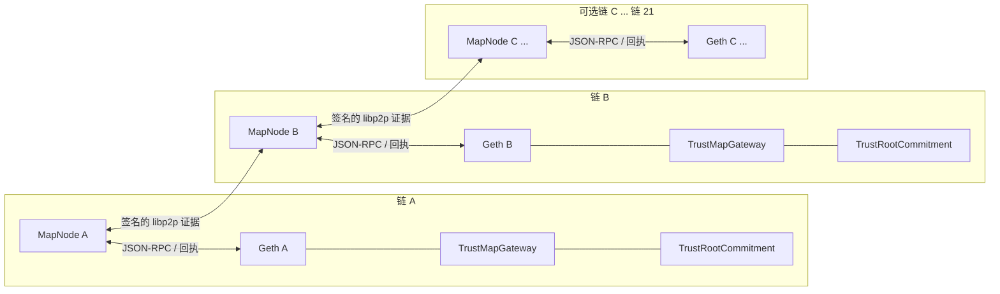

# TrustMap 原型系统

[English](README.md) | [简体中文](README.zh-CN.md)

TrustMap Prototype 是 TrustMap 论文设计的开源实验实现。仓库包含链上信任承诺与验证合约、基于真实 Geth 的多链环境，以及与每条链一一对应、可实际运行的 MapNode。MapNode 会跟踪已确认事件，验证并交换依赖证据，持久化维护 `TrustView`，选择 `DirectPlan` 或 `PathPlan`，并将选定证明提交到本链 Gateway。

> **研究原型。** 本仓库用于复现和评估论文中的验证机制，不是资产桥，也不是生产级安全基础设施。默认的 `pow-spv-3m` Direct 验证器通过真实签名和可校准计算复现目标验证开销；它不是 PoW 轻客户端，不能宣称提供 SPV 安全性。

## 已实现的论文机制

| 论文概念 | 原型中的实现 |
| --- | --- |
| `TrustRoot` | 与区块哈希绑定的链上信任状态承诺；MapNode 从 Geth 规范链区块观察并持久化。 |
| `TrustView` | 每个 MapNode 独立维护的、可持久化且有证据支撑的本地信任图。 |
| `TrustEdge` | 两个链/区块信任节点之间经过验证的依赖关系。 |
| Direct 验证 | `ExperimentalCostedDirectVerifier` 校验有序授权签名，并执行配置的链式 Keccak 轮次以复现论文量级的验证成本。 |
| Path 验证 | `PathProofVerifier` 验证建立在已承诺信任关系上的递归路径。 |
| 规划 | MapNode 比较 Direct 与 Path 的估算成本，确定性选择 `DirectPlan` 或 `PathPlan`。 |
| 多链部署 | Docker Compose 在隔离网络内为每条配置链生成一个 Geth 节点和一个 MapNode。 |
| 实验回放 | 同一个 MapNode 二进制通过独立的 `ReplayTrustView` 和论文兼容成本模型回放历史轨迹。 |

## 系统架构



P2P 网络只用于发现签名证据。规范 Geth 区块头和交易回执、已部署合约字节码以及 Gateway 状态才是权威数据。MapNode 不会仅因为一份证据来自 libp2p 就直接信任它。

## 验证流程

### Direct 验证

1. 目标链 Gateway 发出验证请求，请求绑定源链、源区块、源 `TrustRoot`、目标链上下文和请求标识。
2. 本链 MapNode 等待配置的确认深度，并验证规范事件和源链观察结果。
3. Planner 根据指定 profile 估算 Direct 成本；在回放兼容模式下，该成本采用论文中的高度差成本模型。
4. `ExperimentalCostedDirectVerifier` 执行部署时固定的 Keccak 轮次，并按顺序校验部署时固定数量的 `authorizedSigners` 签名。
5. Gateway 记录依赖并完成请求，由此产生的 `TrustEdge` 可以继续传播给其他 MapNode。

提交者不能自行降低 `hashRounds`、`signatureChecks` 或授权签名者集合；这些参数由拓扑和部署配置固定。

### Path 验证

1. MapNode 验证本地及远端发现的 `TrustRoot` 证据，并在 `TrustView` 中形成 `TrustEdge`。
2. Planner 从目标信任节点向请求的源信任节点搜索有效路径。
3. Planner 使用同一成本 profile 比较 Path 和 Direct 的估算成本。
4. Path 更便宜时，MapNode 构造递归 `PathProof` 并提交到 Gateway。
5. `PathProofVerifier` 验证完成上下文绑定的路径，Gateway 记录新依赖并完成请求。

系统支持 `C:201 -> C:200` 这类普通链内祖先关系；回放在计算与高度相关的成本前会统一归一化高度。

## 主要组件

### 智能合约

| 文件 | 职责 |
| --- | --- |
| `contracts/src/TrustMapGateway.sol` | 请求生命周期、上下文绑定、Direct/Path 分派、依赖记录及完成事件。 |
| `contracts/src/TrustRootCommitment.sol` | 存储并验证链上 TrustRoot 承诺。 |
| `contracts/src/ExperimentalCostedDirectVerifier.sol` | 采用真实签名、并通过部署参数校准成本的实验 Direct 验证器。 |
| `contracts/src/IDirectVerifier.sol` | Gateway 使用的 Direct 验证器接口。 |
| `contracts/src/PathProofVerifier.sol` | 递归 TrustMap 路径证明验证。 |

### MapNode

| 包 | 职责 |
| --- | --- |
| `Mapnode/app` | 运行时装配与工作协程生命周期。 |
| `Mapnode/bootstrap` | 配置、部署清单和验证 profile 校验。 |
| `Mapnode/chain`、`chainabi`、`reorg` | Geth RPC、ABI、规范区块/哈希观察和重组安全。 |
| `Mapnode/indexer` | 已确认 Gateway 事件索引与回执验证。 |
| `Mapnode/evidence` | 本地及远端证据验证。 |
| `Mapnode/p2p` | 基于 libp2p GossipSub 的签名定位信息传播。 |
| `Mapnode/trustview` | `TrustRoot`、`TrustView`、`TrustEdge`、快照和 witness。 |
| `Mapnode/planner` | 确定性的 `DirectPlan`/`PathPlan` 选择。 |
| `Mapnode/proof` | 递归 `PathProof` 构造与证明材料管理。 |
| `Mapnode/coordinator` | 请求、计划和证明状态的持久化流转。 |
| `Mapnode/executor` | 串行执行 Direct/Path 交易、nonce 恢复和回执确认。 |
| `Mapnode/store` | SQLite/WAL 存储、迁移及持久化仓库。 |
| `Mapnode/api` | 最小只读健康、状态、请求和 TrustView API。 |
| `Mapnode/replay` | 独立的 `ReplayTrustView`、B0-B3、成本 profile、断点恢复、导出和 golden 校验。 |

### 工具与配置

| 路径 | 用途 |
| --- | --- |
| `cmd/mapnode` | 启动真实 MapNode 服务或有限回放模式。 |
| `cmd/trustmapctl` | 校验并渲染拓扑定义。 |
| `cmd/replaycheck` | 按 golden 聚合值及逐行语义摘要校验回放产物。 |
| `configs/topology-2.yaml` | 两链 Direct 实验。 |
| `configs/topology.yaml` | 三链递归 Path 实验。 |
| `configs/topology-21.yaml` | 可配置的 21 链静态拓扑。 |
| `configs/replay` | 回放矩阵、profile、checkpoint 和 golden 期望。 |
| `scripts` | 真实链实验和回放入口。 |

## 安全边界与非目标

- `ExperimentalCostedDirectVerifier` 是成本化的证明验证器。真实签名用于保留请求与 Gateway 双向绑定，Keccak 循环用于校准 gas；它不实现区块头链、共识验证或 PoW SPV 安全性。
- P2P 消息只是证据发现线索；证据成为权威状态前，MapNode 必须验证规范链数据。
- 本原型不托管或转移资产，不是跨链桥。
- 为保证实验确定性，交易执行采用串行方式。生产环境的手续费加速、多发送者 nonce 管理及任意第三方替换交易不在范围内。
- 21 链拓扑证明配置渲染和启动能力；它本身不表示已经完成 21 链实时压力测试。
- Replay 估算论文兼容成本，不会为每一条轨迹启动一笔 Geth 交易或执行一次 SPV 验证。

## 环境要求

- Go 1.24.10
- Docker Engine 与 Docker Compose v2
- 用于合约开发和测试的 Foundry 1.4.4
- 集成脚本所需的 Bash 和 `curl`

容器镜像及拓扑使用的工具链版本均已固定，以便复现。

## 快速开始

以下命令均在仓库根目录执行。

```sh
go test -race ./... -count=1
go vet ./...
forge test --root contracts -vv
```

校验并渲染默认三链拓扑：

```sh
go run ./cmd/trustmapctl topology validate --file configs/topology.yaml
go run ./cmd/trustmapctl topology render \
  --file configs/topology.yaml \
  --output runtime/generated
docker compose -f runtime/generated/compose.yaml config --quiet
```

拓扑定义可以控制链数量、chain ID、Geth 出块周期、MapNode 身份、确认深度、端口、验证 profile、签名数量和 hash 轮数。仓库示例支持 2、3 和 21 条链；每条渲染出的链对应一个 Geth 容器和一个 MapNode 容器。

## 真实 Geth 实验

集成脚本会创建隔离的运行目录，渲染拓扑，构建并启动真实 Geth、部署器和 MapNode 容器，执行有超时限制的就绪检查，断言预期链上事件，保留日志，并在结束时移除容器和数据卷。

### 两链 Direct 闭环

```sh
./scripts/run-two-chain-direct.sh
# 等价的集成测试入口：
./tests/integration/live_two_chain_test.sh
```

实验提交从链 A 到链 B 的请求，执行真实 Direct 交易，并断言 `DirectVerificationSucceeded`、`DependencyRecorded` 和 `RequestResolved`，同时检查形成的 `B -> A` 边已经传播。

### 三链 Path 闭环

```sh
./scripts/run-three-chain-path.sh
# 等价的集成测试入口：
./tests/integration/live_three_chain_test.sh
```

实验先建立 `B -> A` 和 `C -> B`，再从 C 请求验证 A。MapNode C 必须在不回退 Direct 的情况下选择并执行两跳 `PathPlan`，测试随后断言 Path、依赖记录和请求完成事件。

生成的运行产物和 Compose 日志位于 `runtime/` 下。该目录属于本地实验状态，不进入源码发布。

## 数据回放实验

`mapnode replay` 是同一个 MapNode 二进制中的有限实验模式。它复用真实 Planner 逻辑，但使用独立的回放数据库和 `ReplayTrustView`，不会启动 Geth、逐行提交交易，也不会修改真实 `TrustView`。

### B0-B3 设置

每种设置拥有隔离的 SQLite/WAL 状态。

| 设置 | TrustMap Planner | Checkpoint 辅助 Direct |
| --- | --- | --- |
| B0 | 否 | 否 |
| B1 | 否 | 是 |
| B2 | 是 | 否 |
| B3 | 是 | 是 |

### 成本 profile

| Profile | Direct 高度步长 | Path 边/高度步长 | TrustRoot 更新 | 用途 |
| --- | ---: | ---: | ---: | --- |
| `legacy-v4.1` | 3,000,000 gas | 30,000 gas | 110,000 gas | 精确复现原模拟器的评估语义。 |
| `prototype-calibrated` | 3,000,096 gas | 30,713 gas | 108,582 gas | 基于本原型实测值的敏感性分析。 |

两种回放 profile 都不声称执行 SPV。真实合约 gas 与回放估算成本明确分离。

### 小规模 smoke 回放

仓库自带 6 行、3 链测试数据，可验证解析、四种设置、Planner 选择、持久化、导出和 golden 校验：

```sh
./scripts/replay-smoke.sh
./tests/integration/replay_smoke_test.sh
```

可选环境变量包括 `TRACE_PATH`、`RUN_ROOT`、`SETTINGS`、`PROFILE` 和 `MAPNODE_BIN`。

```sh
RUN_ROOT=/tmp/trustmap-smoke \
SETTINGS='B2,B3' \
PROFILE=prototype-calibrated \
./scripts/replay-smoke.sh
```

### 245,000 条消息的全量回放

完整历史轨迹目前**尚未存入本仓库**，仓库仅包含小规模测试 fixture。为兼容当前本地实验，`scripts/replay-full.sh` 默认以只读方式查找相邻路径 `../TrustMap-ETH/Dune/output_202512/msg.csv`。开源使用者需要显式提供轨迹：

```sh
TRACE_PATH=/absolute/path/to/msg.csv \
RUN_ROOT=/absolute/path/to/replay-runs \
SETTINGS='B0 B1 B2 B3' \
PROFILE=legacy-v4.1 \
./scripts/replay-full.sh
```

也可使用等价参数：

```sh
./scripts/replay-full.sh \
  --trace /absolute/path/to/msg.csv \
  --run-root /absolute/path/to/replay-runs \
  --settings 'B0 B1 B2 B3' \
  --profile legacy-v4.1
```

项目提供了用于获取实验数据的 Dune Query 脚本。受仓库体积限制，不直接提供完整原始数据和预处理后的全量轨迹；使用者可以运行 Query 获取数据，或通过 `TRACE_PATH` 指定已有的预处理轨迹。

对于规范的预处理轨迹，校验器期望：

| 属性 | Golden 值 |
| --- | ---: |
| SHA-256 | `ae35b6fd51185822dcfd8e338b2af43735bb2141764feead9ec993633a232175` |
| 预处理后行数 | 245,000 |
| 链数量 | 21 |
| B2 选择 TrustMap 次数 | 111,058 |
| B3 选择 TrustMap 次数 | 91,829 |
| 最终图节点数 | 453,949 |
| 最终图边数 | 1,152,851 |
| 跨链边数 | 245,000 |

Golden 校验还会检查精确的逐行决策、路径、成本和语义摘要。只有在主动运行子集或自定义轨迹时才使用 `--no-golden`。

### 断点恢复与输出

相同 `RUN_ROOT` 在轨迹、profile、设置、checkpoint 策略和快照周期均一致时可以确定性恢复；运行身份不兼容时会拒绝继续，输入变化后应使用新目录。

每种设置的独立目录包含：

- `replay.db` 及 SQLite WAL 状态；
- `decisions.csv` 和 `decisions_extended.csv`；
- `summary.json`、`progress.json` 和 `run_manifest.json`；
- `init_heights.csv` 及配置的 checkpoint 材料；
- B2/B3 的路径和图快照产物。

也可以独立校验产物：

```sh
go run ./cmd/replaycheck \
  --run-root /absolute/path/to/replay-runs \
  --golden configs/replay/golden/legacy-v4.1-full.json
```

配置字段、Docker 运行方式、恢复规则和产物细节见[回放实验指南](docs/replay-experiments.md)。

## 单独运行 MapNode

通常由拓扑渲染器生成每个 MapNode 的 JSON 配置和部署清单，也可以直接启动服务：

```sh
go run ./cmd/mapnode serve --config /absolute/path/to/mapnode.json
```

仍兼容不带子命令的旧形式：

```sh
go run ./cmd/mapnode --config /absolute/path/to/mapnode.json
```

使用绝对路径回放配置单独运行一种设置：

```sh
go run ./cmd/mapnode replay \
  --config /absolute/path/to/replay.yaml \
  --setting B2
```

不加载配置即可检查运行实例：

```sh
go run ./cmd/mapnode --healthcheck http://127.0.0.1:8080/health/ready
```

## 只读 API

| 端点 | 用途 |
| --- | --- |
| `GET /health/live` | 进程存活状态。 |
| `GET /health/ready` | 运行时就绪状态。 |
| `GET /v1/status` | 本链、Indexer、Executor 和 Peer 状态。 |
| `GET /v1/requests/{requestId}` | 持久化请求、规划及执行状态。 |
| `GET /v1/trustview` | 当前有证据支撑的 TrustView 摘要。 |

API 有意保持只读；协议动作由已确认链上事件和 MapNode 工作协程驱动。

## 仓库结构

```text
TrustMap_prototype/
├── contracts/             Gateway、TrustRoot、Direct 和 Path 验证合约
├── Mapnode/               真实 MapNode 与回放实现
├── cmd/                   mapnode、trustmapctl 和 replaycheck 入口
├── configs/               多链拓扑和回放配置
├── docker/                Geth、部署器和 MapNode 容器定义
├── scripts/               真实链及回放实验入口
├── tests/                 单元/集成测试和小规模回放 fixture
├── docs/                  可追踪性与详细实验文档
├── data/                  预留给可公开的数据工具和产物
└── runtime/               本地生成状态与实验输出（忽略提交）
```

## 验证命令

```sh
go test -race ./... -count=1
go vet ./...
CGO_ENABLED=0 go build ./cmd/mapnode
CGO_ENABLED=0 go build ./cmd/trustmapctl
forge test --root contracts -vv
./tests/integration/container_build_test.sh
./tests/integration/replay_smoke_test.sh
```

两个真实链集成测试会构建容器并启动 Geth 网络，耗时更长；验证完整闭环时应单独执行。

## 可复现性要求

- 每组报告结果应保存拓扑、部署清单、验证 profile、轨迹摘要和运行清单。
- 与原模拟器比较时使用 `legacy-v4.1`；`prototype-calibrated` 只能作为独立标注的敏感性结果。
- 不能将真实合约 gas 和回放估算 gas 当作同一执行路径产生的数据直接混用。
- 记录 Git commit，并保留生成的 `run_manifest.json` 与 Compose 日志。

上文固定的期望值是兼容性目标，并非对某次仍在运行的本地实验的结果汇报。

## 进一步文档

- [回放实验指南](docs/replay-experiments.md)
- [设计—实现可追踪性](docs/traceability.md)

## 引用

本仓库实现 TrustMap 论文所评估的设计。论文和归档数据正式公开后，应在此补充最终引用信息。在此之前，请引用实验使用的仓库 commit，并明确注明所采用的回放 profile。
